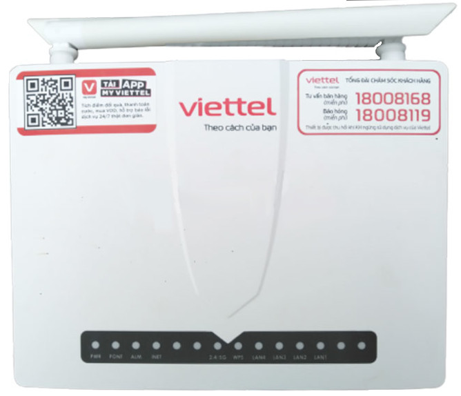

# Unlock-421wd

Root shell + unlock **Viettel vG-421WD**.

[**Watch the tutorial video here.**](Assets/Unlock-421wd.mp4)



## Overview

This repository provides tools and scripts to gain root shell access on the **Viettel vG-421WD** GPON router. The process involves:

1. Enabling a temporary telnet/SSH session through a vulnerability in the web admin panel.
2. Enabling permanent root access from the temporary session.
3. Disabling remote management (TR-069 / TMS).
4. Optionally accessing the USB drive through the unpopulated USB port (comming soon).

## Router Info

| Property | Value |
|---|---|
| **Device** | Viettel vG-421WD |
| **Firmware** | `V2803241218` |
| **Kernel** | Linux 3.18.21 |

## Requirements

- A web browser (for the admin panel exploit)
- Access to the router's web interface (default: `http://192.168.1.1`)
- An SSH/Telnet client (e.g. PuTTY, OpenSSH)

# Step 0 - Clone the Repository

```bash
git clone https://github.com/ElectroHeavenVN/unlock-421wd.git
cd unlock-421wd
```

## Step 1 - Enable Temporary Telnet via Web UI

1. Log in to the router's web admin panel.
2. Open **Developer Tools** (F12) → **Console**.
3. Login to the web panel (default username: `admin`, password: check the label on the back of the router).
4. Paste the contents of **[`Unlock temp telnet.js`](Unlock%20temp%20telnet.js)** and press **Enter**.
5. Connect via telnet or SSH:

```bash
telnet 192.168.1.1
# or
ssh admin@192.168.1.1 -p 9777
```
Password for telnet/SSH: `euclid@vht380`.

> **Note:** The temporary shell session has a timeout. Use Step 2 to make it permanent.

## Step 2 - Unlock & Disable Remote Management

Once you have a shell, upload and run **[`unlock_421wd.sh`](unlock_421wd.sh)** on the device. This script:

1. **Enables permanent telnet** - Sets the system state so telnet stays enabled across reboots.
2. **Disables TR-069 (CWMP)** - Prevents Viettel's ACS server from remotely reconfiguring or updating the router.
3. **Disables TMSClient (MQTT)** - Stops the router from reporting telemetry to Viettel's cloud.

```bash
# on your local Linux machine:
python3 -m http.server 8000
```
or:
```cmd
REM on your local Windows machine:
python -m http.server 8000
``` 

```bash
# On the router shell:
curl -o /tmp/unlock_421wd.sh http://<your_pc_ip>:8000/unlock_421wd.sh
chmod +x /tmp/unlock_421wd.sh
/tmp/unlock_421wd.sh
```

## Firmware Analysis

The full firmware dump (`421wd_dump.bin` inside `421wd_dump.7z`) can be analyzed with **binwalk**. Parts of the extracted data are included in the `extractions/` folder.

## Disclaimer

This project is for **educational and research purposes only**. Modifying your router's firmware or configuration may void your warranty, brick your device, or violate Viettel's terms of service. Use at your own risk. The authors are not responsible for any damage caused by the use of these tools.

## License
This project is licensed under the MIT License - see the [LICENSE](LICENSE) file for details.